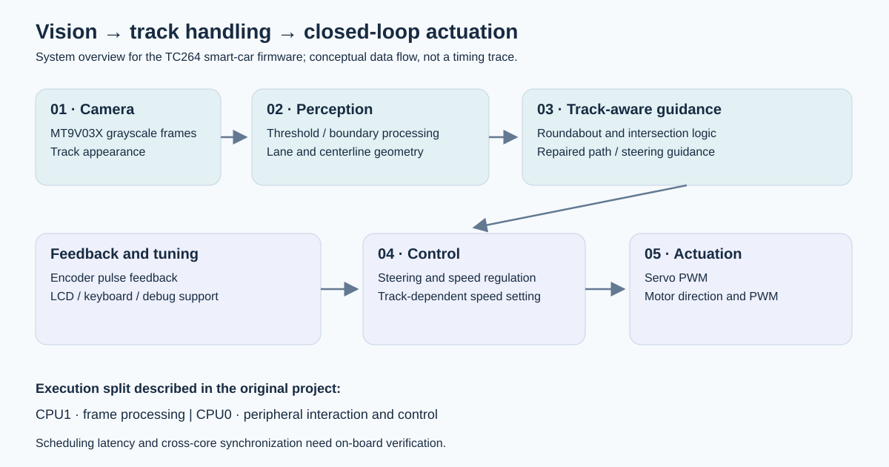
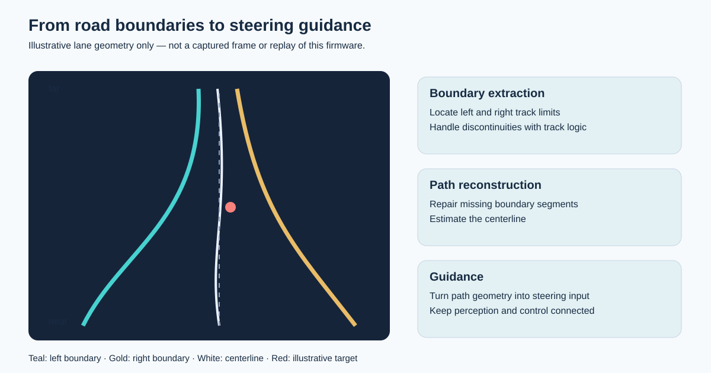
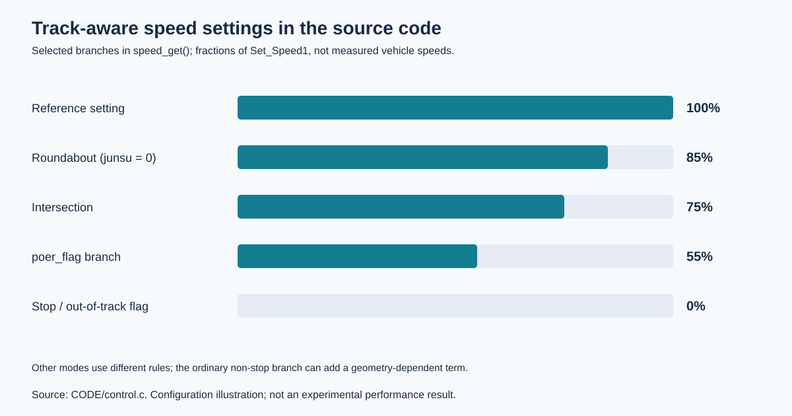
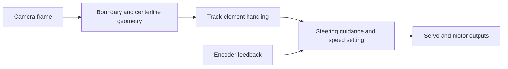

# Vision-Guided Autonomous Smart Car

**Embedded track perception, track-aware guidance and closed-loop vehicle control on TC264.**

## Demo Video

[](docs/media/smart-car-demo.mp4)

**[▶ Watch the demo video](docs/media/smart-car-demo.mp4)** — project demonstration footage provided by Ashley Liu. Click the preview to open the MP4; download it if your browser does not offer playback. The preview is a title card, not a frame from the video.

A competition smart-car project using an **Infineon TC264D** and an **MT9V03X grayscale camera**. Road geometry guides steering; encoder feedback supports motor control. The original project reports a **First Prize** competition result.

**Author / portfolio owner: Ashley Liu (Xinying Liu).**



[Perception](#perception-from-pixels-to-path) · [Control](#control-track-aware-speed-and-actuation) · [Code guide](#where-to-start-reading) · [Build](#building-for-the-vehicle)

## Engineering problem

A straight segment, a missing boundary and a roundabout arrive through the same camera interface but require different handling. The challenge is to maintain usable path geometry and translate it into consistent actuation.

| Challenge | Design approach |
|---|---|
| Incomplete road geometry | Boundary repair and centerline reconstruction |
| Distinct track elements | Dedicated roundabout and intersection handling |
| Changes in guidance and road state | Track-dependent speed settings and steering correction |
| Hardware-dependent tuning | On-board interaction and debugging support |

The reviewed modules use geometric vision and embedded C; no trained neural perception model is identified in them.

## Perception: from pixels to path



*An explanatory drawing, not a captured camera frame or firmware replay.*

[`CODE/image_deal.c`](CODE/image_deal.c) includes `Ostu()` thresholding over three image regions and an adaptive-threshold call. The inspected image access uses a 188-column pointer and 70 rows; these are source dimensions, not a measured frame rate. `advanced_regression()` fits center/left/right line data, and `Center_line_deal()` maintains path geometry.

[`CODE/traffic_cricle.c`](CODE/traffic_cricle.c) searches boundary turning points and reconstructs segments by interpolation. These routines expose practical design questions: which rows should influence guidance, how to repair missing geometry, and when special-element logic should override ordinary following.

## Control: track-aware speed and actuation



**These bars represent configured control rules, not measured speed or lap-time results.**

In [`CODE/control.c`](CODE/control.c), selected `speed_get()` branches scale `Set_Speed1`: roundabout handling with `junsu == 0` uses 85%, intersection handling uses 75%, and `poer_flag` uses 55%. Stop/out-of-track flags set the target to zero. Other branches differ; normal operation can add a geometry-dependent term.

The module also reads encoder counters, clears them, and drives direction GPIOs and PWM outputs. Target values require vehicle-specific calibration and are not physical speeds in meters per second.

## Execution model

The original overview describes image processing on **CPU1**, with peripherals and control on **CPU0**. The architecture image summarizes that division; it is not a measured scheduling trace. See [`USER/`](USER/) for startup and interrupt integration.



## Where to start reading

| File / directory | Reading focus |
|---|---|
| [`CODE/image_deal.c`](CODE/image_deal.c) | Thresholding, geometry and line fitting |
| [`CODE/traffic_cricle.c`](CODE/traffic_cricle.c) | Turning points and roundabout repairs |
| [`CODE/control.c`](CODE/control.c) | Speed policy, encoder reads and motor outputs |
| [`CODE/PID.c`](CODE/PID.c) | Controller implementation |
| [`CODE/keyboard.c`](CODE/keyboard.c) | Parameter interaction |
| [`CODE/swj.c`](CODE/swj.c) | Debug / communication utilities |
| [`USER/`](USER/) | Core startup and interrupt integration |
| [`Libraries.zip`](Libraries.zip) | Support-library archive |

Start with perception and control, then follow startup code to establish which routines execute in the deployed configuration. A function's presence does not establish that every branch is active on every run.

## Outcome and evidence

| Item | Available evidence |
|---|---|
| Competition outcome | First Prize, as reported in the original project description |
| Perception and control implementation | Public C source linked above |
| Speed-policy illustration | Selected active source branches |
| Firmware rebuild during this documentation pass | Not performed |
| Measured latency, lap time, completion rate or tracking error | No recorded measurement used here |

No numerical performance result is inferred from configuration constants. Synchronized camera/steering telemetry and repeated track runs would provide the next useful experimental evidence.

## Personal contribution

The original overview attributes Ashley's work to perception, boundary/centerline extraction, target generation, steering/speed control, special-track handling, tuning/debugging and integration. Board support and third-party libraries remain distinct from application contributions.

## Building for the vehicle

This source targets the TC264 board environment. A desktop compilation alone is insufficient to produce a working vehicle image.

1. Set up the matching TC264 toolchain and board-support project; inspect the bundled support archive before integrating it.
2. Add `CODE/` and `USER/`, configure includes, startup/linker settings and the correct hardware pin mapping.
3. Verify camera setup, encoder polarity, servo limits and motor-direction conventions against the vehicle.
4. Compile and flash with the board's toolchain. Validate peripherals, then perform controlled track runs and record behavior.

Exact toolchain versions, wiring and flashing settings should be recovered from the original environment. A clean firmware rebuild was not verified for this README update.

## Documentation visuals

The SVG images explain the source; they are not photographs, footage or experimental traces. See [evidence notes](docs/README_EVIDENCE.md) for interpretation and sources.

Regenerate them with Python 3.10+ and the standard library:

```bash
python scripts/render_readme_figures.py
```

Useful follow-ups are actual camera-frame overlays, a documented track-run protocol, telemetry plots and explicit cross-core handoff documentation. These remain future additions.

## License

See [`LICENSE`](LICENSE). Third-party support code may carry separate terms.
